# 溪頭 + 阿里山 三天兩夜露營 2021/09/26

難得冠德提出要嘗試露營的要求, 身為專業的推坑仔怎麼能不趁這個機會帶領他體會一下露營的美好.
 
行程上選定了好久以前說要去的杉林溪與阿里山. 好家在剛好我們都處在工作的轉換空檔, 
不然依據這兩個景點的熱門程度大概會塞到翻臉. 
* [Day 1](#day1)
* [Day 2](#day2)
* [Day 3](#day3)

<h2 id="day1"> Day 1 </h2>

週日起了一個大早買齊了晚餐的火鍋的食材, 坐上了冠德的Altis就直奔杉林溪. 
還好出門得早又逢假期結束, 沿路上沒有遇到太多車流. 
第一次在溪頭附近露營, 就隨手找了個google評分蠻高的露營地. 

847營地 [google maps](https://www.google.com.tw/maps/place/847%E9%9C%B2%E7%87%9F%E5%8D%80/@23.7612407,120.7384725,17z/data=!3m1!4b1!4m5!3m4!1s0x346ed2f607a65b95:0x7fe14b9b5b4e7f53!8m2!3d23.7612358!4d120.7406612) / [website](http://847.ego.tw/)
<table>
	<tr>
		<td>ℹ️ </td>
		<td colspan="2">📷</td>
	</tr>
	<tr>
		<td width="400">剛進到營地聽到小孩子的尖叫聲還怕晚上會不得安寧. 
好家在中午前他們就打包走了:joy: 運氣很好今天只有我們一帳. 營地雖然不大, 但是滿地的楊桃可以隨便採摘. 特地為了這次露營去迪卡農買了天幕, 不過搭起來比預期的小很多... :cry: 第一次搭天幕, 花了近30分鐘才弄好 但不知道為甚麼中間都拉不直...</td>
		<td>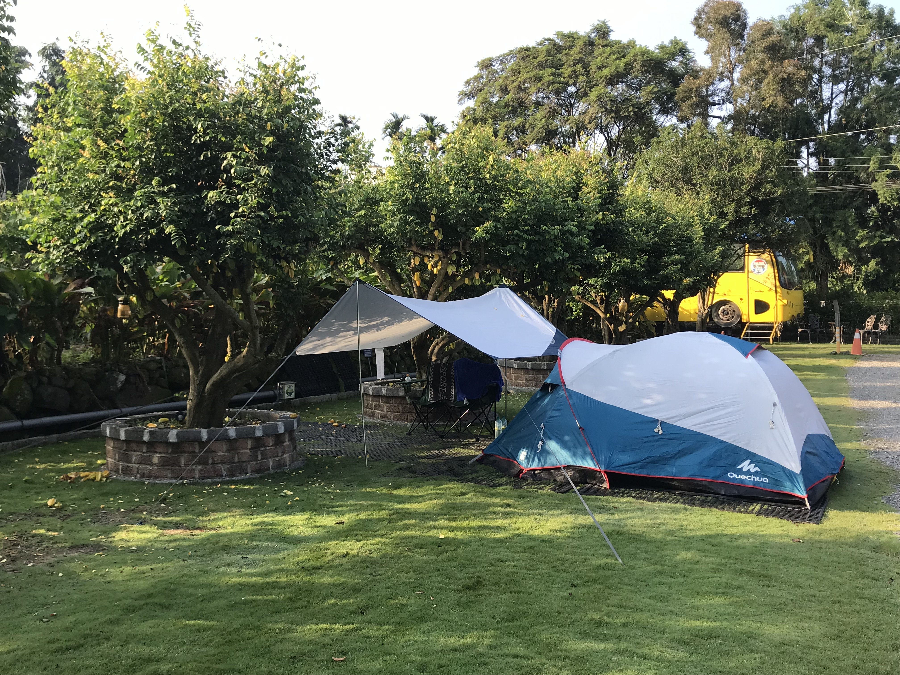</td>
	</tr>
    <tr>
        <td>花了一個小時才搞定營地, 正值9月天氣炎熱. 看著滿樹的楊桃, 我不經有個大膽的想法...</td>
        <td>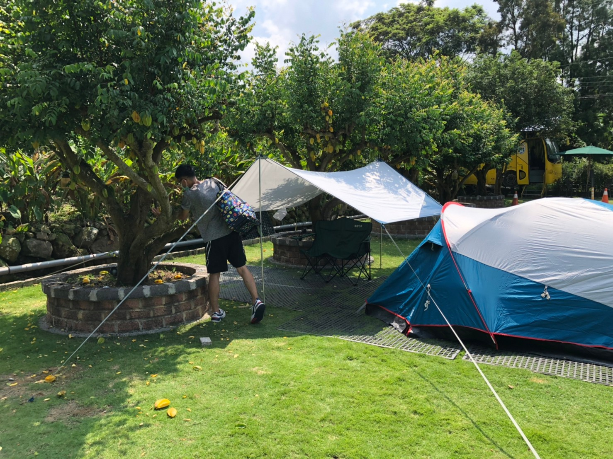</td>
    </tr>
</table>

這次的行程安排上有點問題, 原本是打算去杉林溪. 
但路途遙遠加上搭完營帳已經是下午兩點. 從營地過去杉林溪還需要一個多小時. 
因此最後決定在溪頭森林遊樂區走走. 杉林溪又再次pending了 :disappointed: 

<table>
	<tr>
		<td>ℹ️ </td>
		<td colspan="2">📷</td>
	</tr>
	<tr>
		<td width="400">溪頭森林遊樂區海拔超過1000公尺, 相較於山下炎熱的氣溫舒適了不少. 園區內種植紅檜, 扁柏等樹種,  空氣清晰令人心曠神怡. 有點可惜園區五點就結束營業, 沒有太多時間駐足停留享受這難得的平靜.</td>
		<td colspan="2">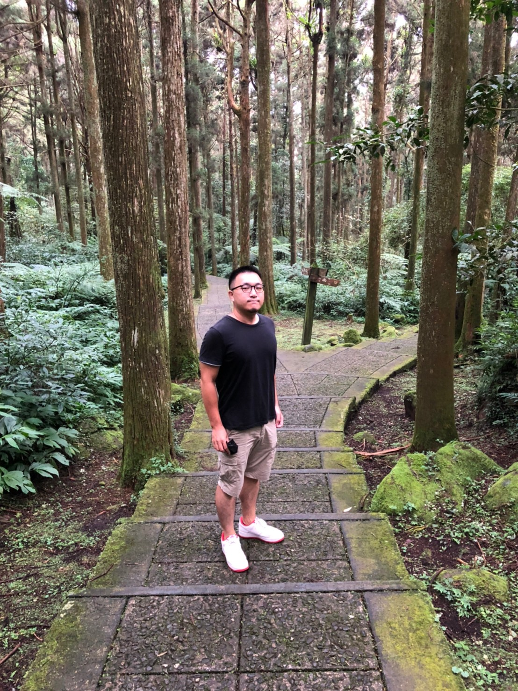</td>
	</tr>
    <tr>
        <td>大學池一景. 園區內有大面積台大的實驗林場. 估計大學池因是為此而命名. 竹製拱橋橫跨池塘兩側更顯文學氣質. 不過與冠德的氣質明顯不符...  天空步道最大的高度落差20多公尺, 即使站在離地7層樓的高空仍無法觸及 樹木頂端.</td>
        <td colspan="1">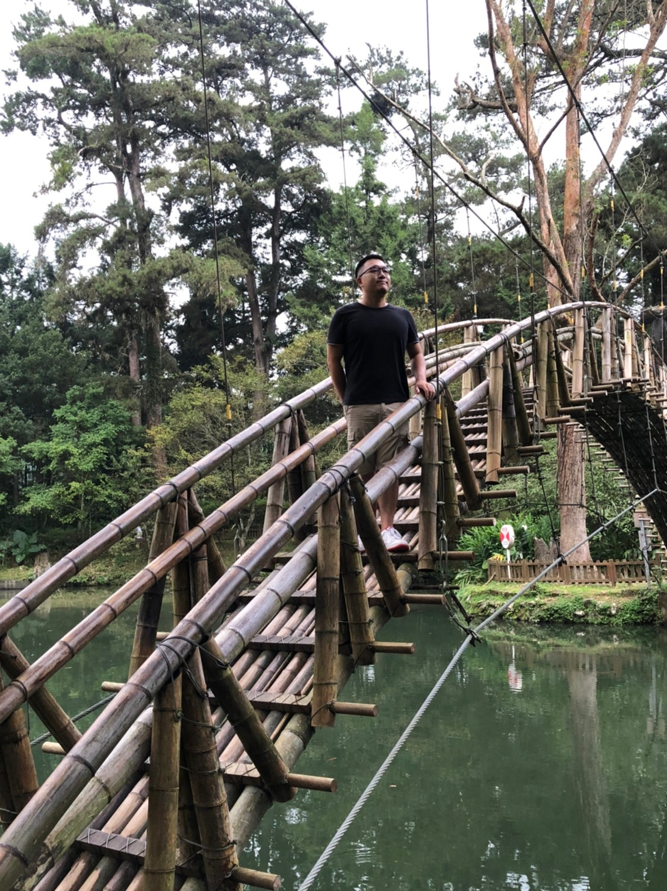</td>
		<td colspan="1">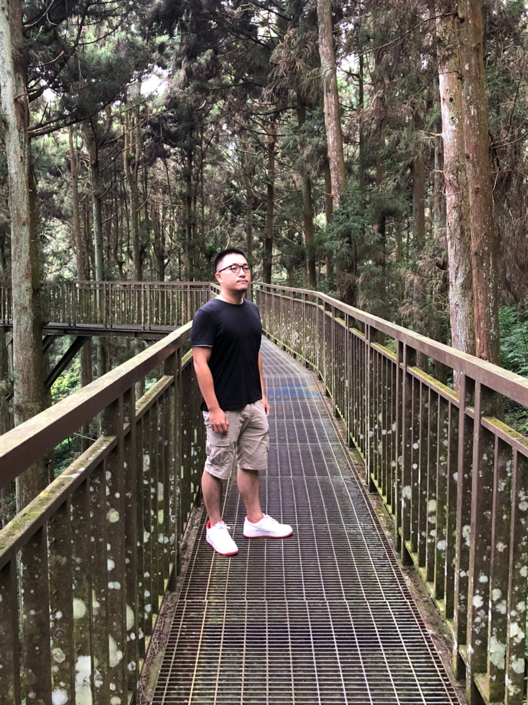</td>
    </tr>
</table>

<h2 id="day2">Day 2</h2>
早晨匆匆收拾好營地便坐上冠德的愛駒再次上路. 
近年國共關係惡劣, 嘉義已經沒了當初陸客人山人海的光景. 
少了橫行於台18的遊覽車大隊, 攻頂再也不用忍受塞車的痛苦. 
看了網路上的評論, 原本是打算在蒼伯露營地度過一晚, 可惜正逢營地整修. 
最後我們選擇在羅老爸的家紮營, 
雖然營區小且不夠開闊, 要看夜景可能沒辦法在營區內觀賞星空, 但營地營主非常熱心而且營地設備完善. 

<table>
	<tr>
		<td>ℹ️ </td>
		<td colspan="2">📷</td>
	</tr>
	<tr>
		<td width="400">受火災影響, 台18實施單線雙向管制. 整點放行, 沒事先做好功課的我們卡在關口半個小時.  百般無聊下隨手拍了下窗邊的景色, 沒想到竟如此開闊壯麗.</td>
		<td colspan="2">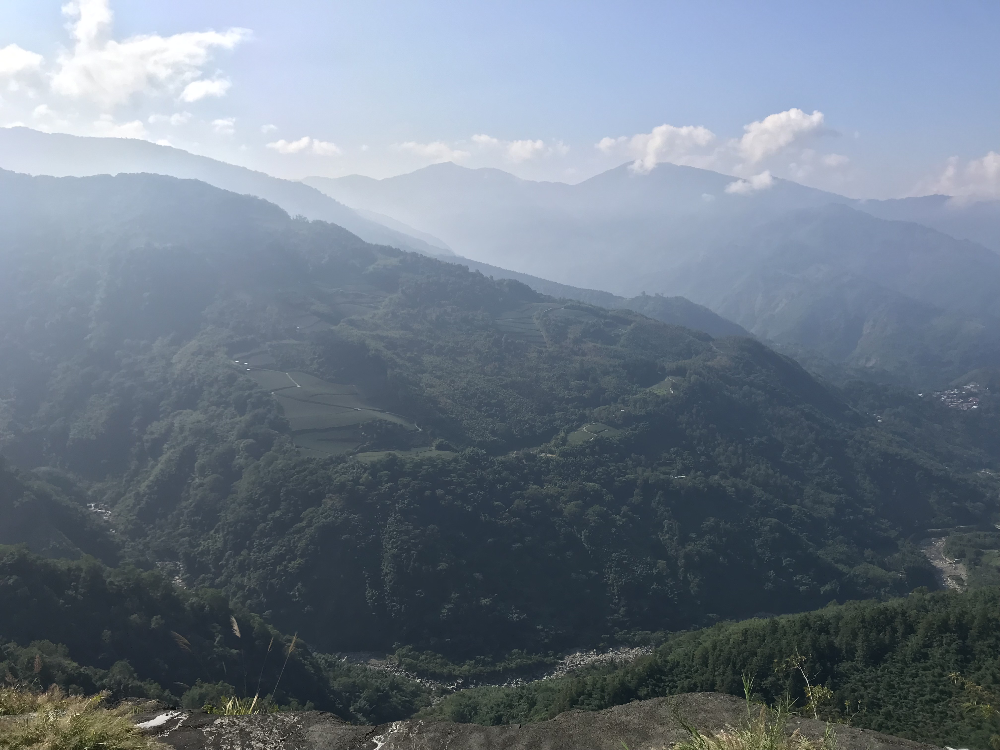</td>
	</tr>
	<tr>
		<td>紮營後冠德便提議想去奮起湖, 聽到奮起湖的名頭我不經眉頭一皺, 極力勸說可以去其他的景點. 何奈德哥心意已決, 只好陪他去奮起湖走走. 
		</td>
		<td colspan="1">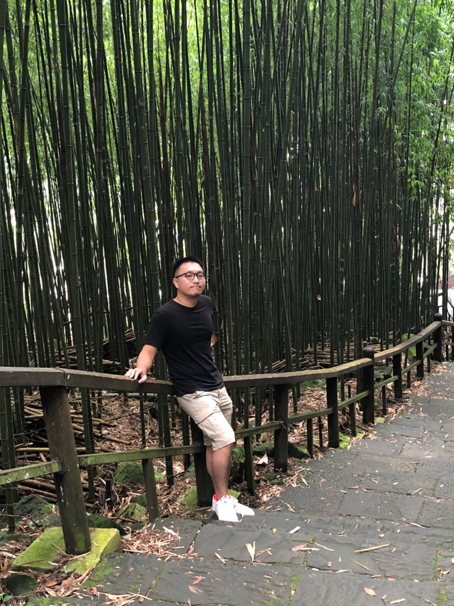</td>
		<td colspan="1">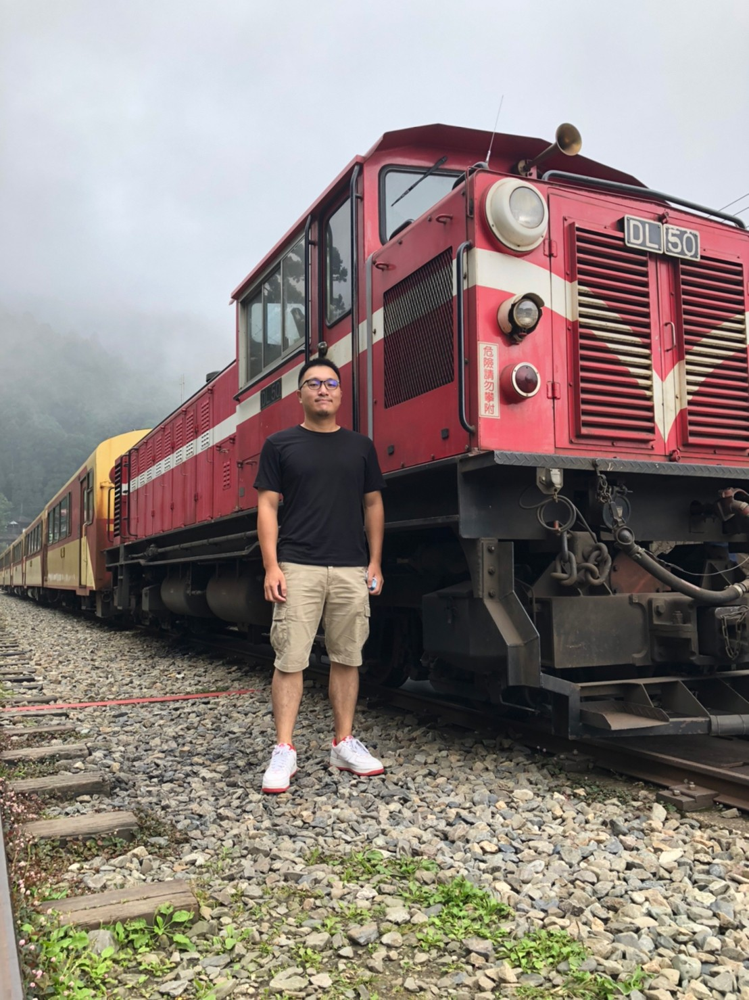
	</tr>
    <tr>
        <td>約莫一個小時不到便結束了奮起湖的行程. 距離日落還有些許時間,便前往迷糊步道一探究竟. 步道竹林環繞, 本是消除夏天酷暑的好地方, 怎奈蚊子如狼似虎, 還沒走完一半我們就逃了回來.</td>
        <td colspan="2">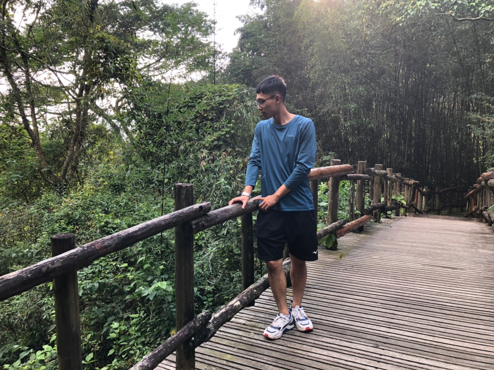</td>
    </tr>
</table>

<h2 id="day3">Day 3</h2>
早上趁著車流不大, 收拾好行李便前往此次行程的最後一站 : 阿里山森林遊樂區. 
雖然從前在嘉義讀書時, 時常與朋友來阿里山遊玩, 但進入園區的次數卻屈指可數. 
興許是學生對於要付錢的事物會下意識的進而遠之吧. 

<table>
	<tr>
		<td>ℹ️ </td>
		<td colspan="2">📷</td>
	</tr>
	<tr>
			<td width="400">香林神木是第二代神木(原神木於1997年傾倒), 是目前園區內還存活神木中最古老的紅檜. 距今已有2300年的歷史 其龐大身軀手機鏡頭近距離都難以容下. </td>
			<td colspan="2">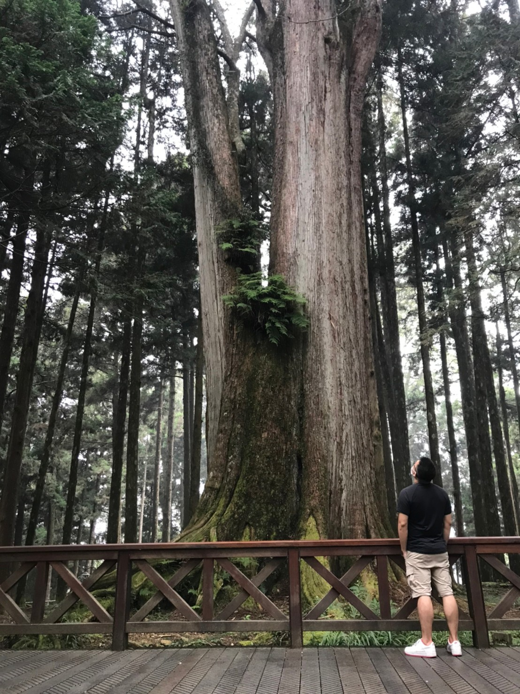</td>
	</tr>
	<tr>
		<td>巨木群棧道是園區內有名的景點,  棧道行經38個具800年以上歷史的神木. 踏足於棧道上好似數千年光陰一閃而過,  園區內的神木最久至漢光武帝建國,  人類歷史興衰交替, 但對於樹木來說卻僅是 濃淡不分的年華逝去.</td>
		<td>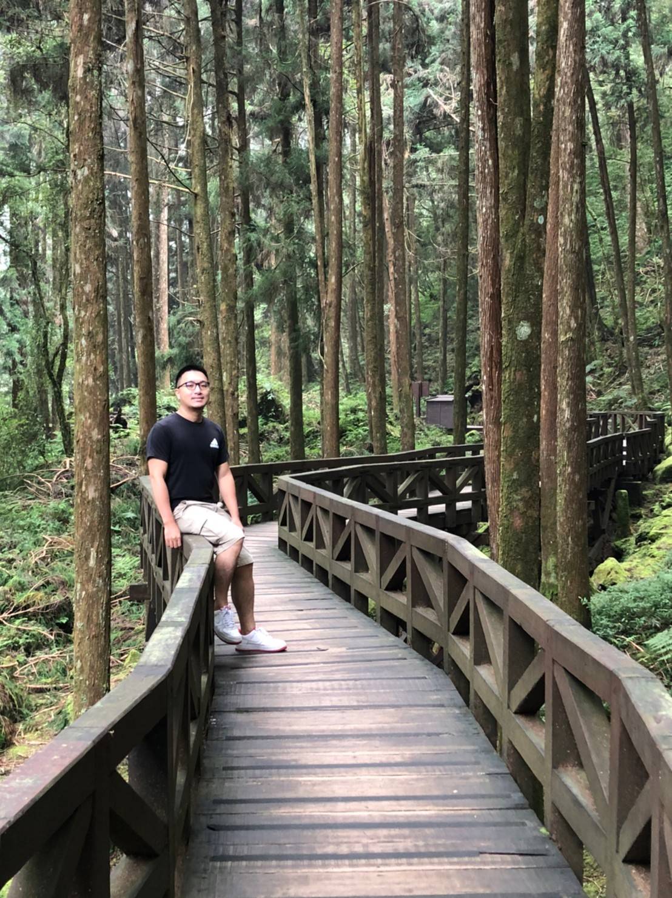</td>
	</tr>
	<tr>
		<td>這次行程安排得太過緊湊,實在沒體力去 祝山看日出, 只好拍張火車照過過乾癮了.
		</td>
		<td>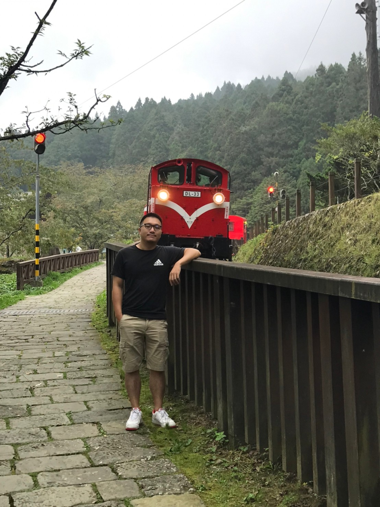</td>
	</tr>
</table>

## 結語
總歸有點可惜行程安排的不好, 原先是希望在上班前渡過一個慵懶的周末. 
結果幾乎都在開車與趕行程, 帳篷拆了又裝浪費太多時間. 
未來規劃應該還是要以單一的景點延伸行程. 

