# 馬祖 2021
紀錄在2021/9月與冠德的馬祖三日遊
* [Day 1](#day1)
* [Day 2](#day2)

## Day 0.5

| ℹ️ | 📷 |
| --- | --- |
|被基隆港東岸停靠的星夢郵輪吸引, 特地從火車站跑過去 結果我們坐的是對岸的台馬之星QQ|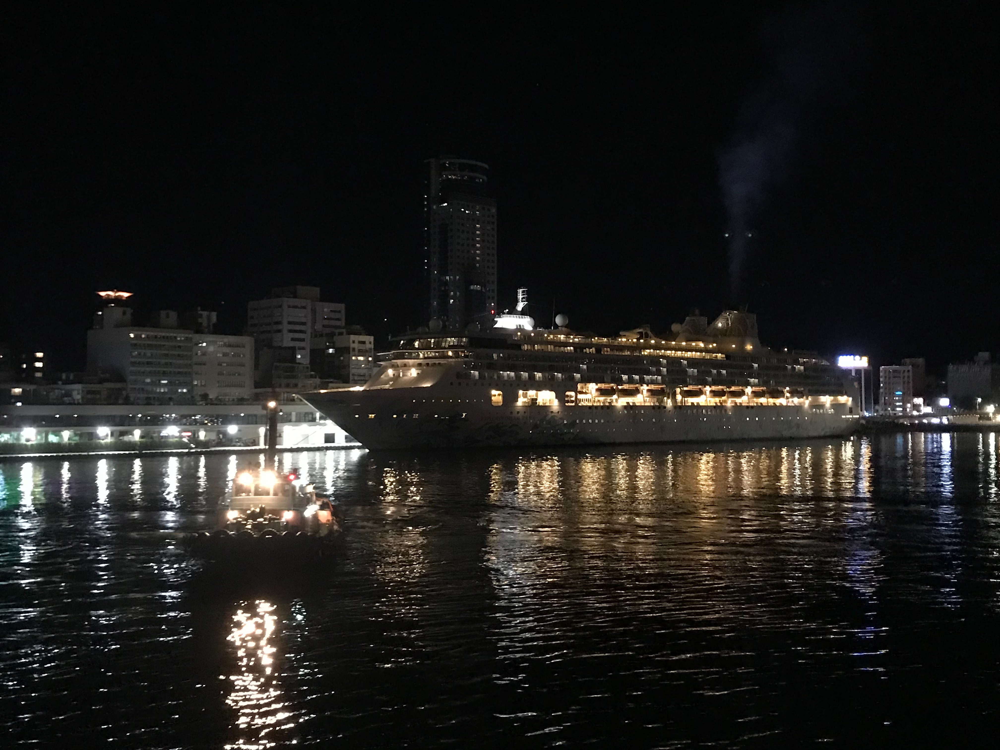|
|因為疫情影響, 去離島前都要先採撿i, 採撿完已經快到搭船的時間了, 在基隆夜市匆匆吃碗油飯就準備出發了|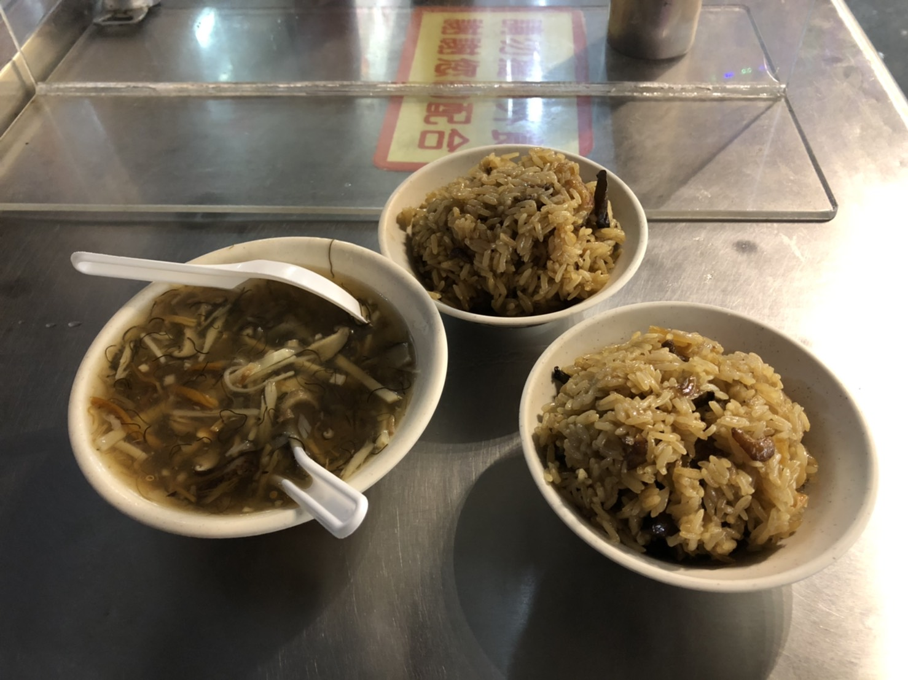|

<h2 id="day1">Day1</h2>

從基隆港出發到馬祖南竿的福澳港大概要10小時. 
還好選擇在晚上時出發, 睡起來就到東引了. 
原本還擔心船上晃動太大不容易入睡, 結果一躺下就睡著了:joy:
| ℹ️ | 📷 |
| --- | --- |
|聽說東引是馬祖最漂亮的島嶼, 有點可惜行程太趕沒辦法規劃,只能在留影紀念一下 |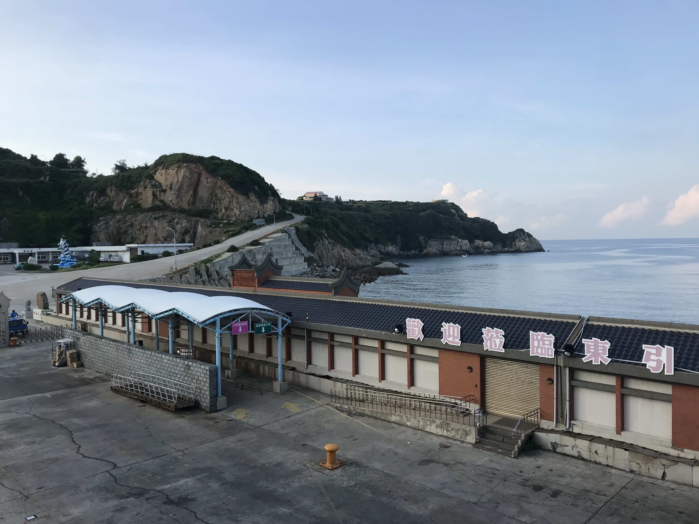|
|10個小時的航行後終於到了福澳港, 一入港口就看到斗大的枕戈待旦. 馬祖上的軍事文化保留得很完整, 四處都能見到國共內戰時的標語.|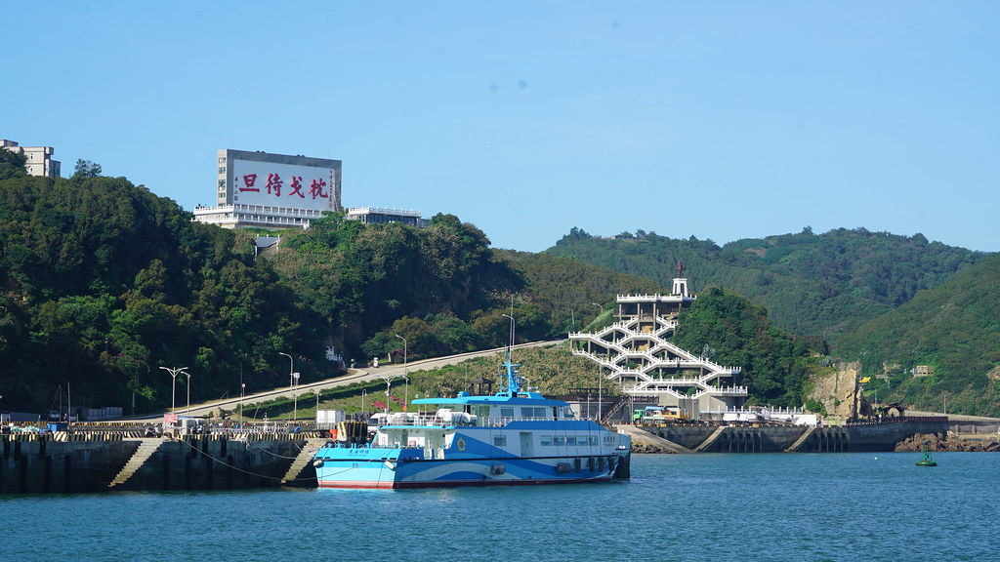|

下船時被馬祖炙熱的太陽嚇到了. 雖然已經入秋了, 但是當時氣溫還有32度. 
還好熱心的房東立刻就把我們接去民宿. 
不得不說我們這次住的[香草民宿](https://www.facebook.com/%E6%B4%A5%E6%B2%99%E9%A6%99%E8%8D%89%E6%B0%91%E5%AE%BF-136171666927031/)應該是我遇過最熱情的民宿老闆 
不但免費幫我們升級房型, 還詳細的介紹南竿的景, 最後離去時還贈送一人一杯老酒冰沙. 

昨天在夜市只匆匆的吃了一碗油飯, 安置好行李後精神放鬆下來, 馬上就感到飢餓. 
景點啥的可以等等, 但吃飯可不能. 
因為疫情的影響, 其實很多商店都休息了. 
找到一家google評分還不錯的店就進去了, 沒想到卻吃到我此生吃過最好吃的淡菜. 
比薩大王 [Google Maps](https://www.google.com/maps?q=%E6%AF%94%E8%96%A9%E5%A4%A7%E7%8E%8B&um=1&ie=UTF-8&sa=X&ved=2ahUKEwj-oIGJ6-vyAhW9y4sBHTU2AcIQ_AUoAXoECAIQAw) / [Website](https://m.facebook.com/pages/%E6%AF%94%E8%96%A9%E5%A4%A7%E7%8E%8B/214055028640139)
| ℹ️ | 📷 |
| --- | --- |
|九月是淡菜的季節, 個大肥美, 口感跟在台灣吃到冷凍過的淡菜全然不同. 淡菜入口鮮味爆炸, 相比台灣吃到用五味醬壓抑冷凍味 簡直就是不同的物種 價格挺高的.  不過海鮮嘛, 吃個味道就好免得痛風:sweat_smile:|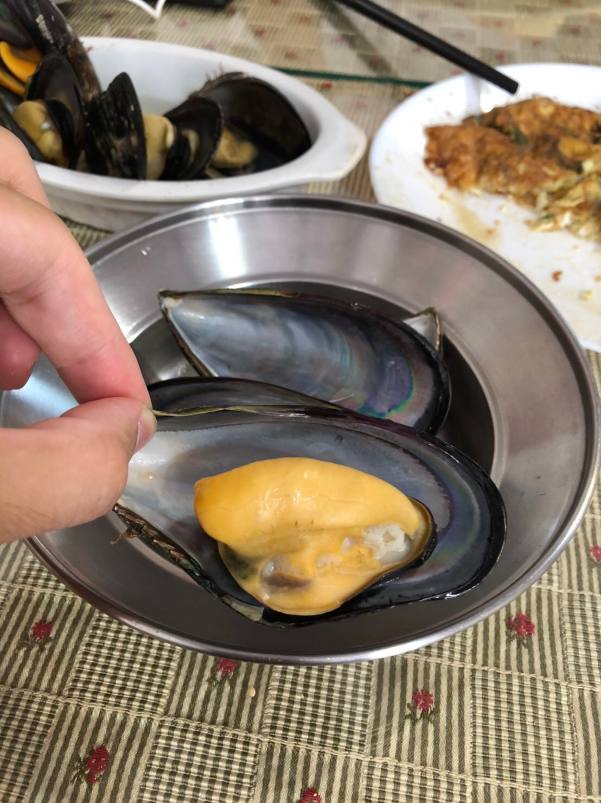|
|馬祖漢堡是馬祖特有的繼光餅夾入各式配料組成的漢堡, 繼光餅比一般漢堡皮更扎實, 我跟阿德都比較喜歡這種. 配料是蔥蛋加鮮蚵, 鮮蚵非常新鮮沒有異味. 後來又吃了幾次漢堡, 但大部分是油炸. 這裡用烤的較清爽, 連吃了兩個也不覺得油膩.|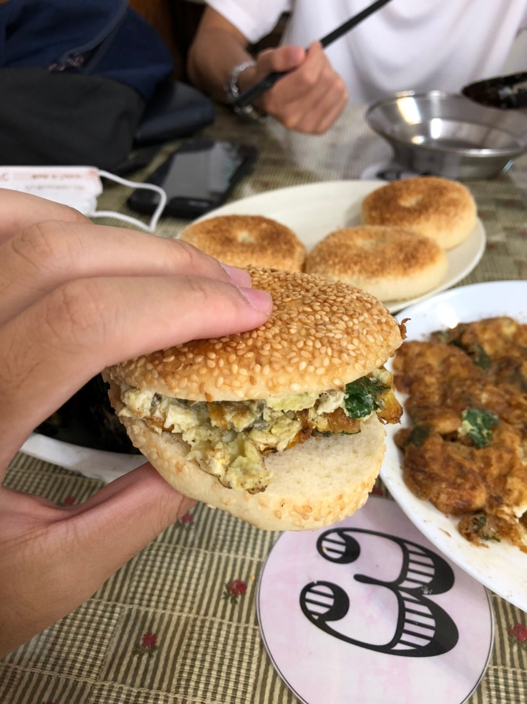|

酒足飯飽後終於要開始在馬祖上的探險, 本來的規劃是搭乘台灣好行一路遊玩. 
沒想到訂位兩個星期後, 承辦人員打電話告知行程人數不夠只能取消:disappointed: 
只好騎著民宿提供的機車四處逛逛了 

<table>
	<tr>
		<td>ℹ️ </td>
		<td colspan="2">📷</td>
	</tr>
	<tr>
		<td>巨大的媽祖像守護著馬祖.  媽祖是當地的中心信仰, 四處都能看到天后宮, 可見當時馬祖人漁業的危險性. </td>
		<td colspan="2">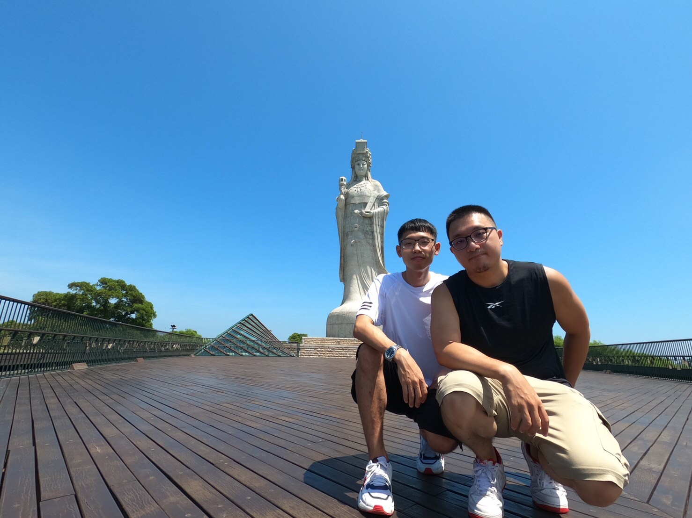</td>
	</tr>
	<tr>
		<td>從媽祖像錢的撩望台向東看去, 湛藍的大海讓都市人窮忙的精神放鬆了不少. 公司上映著的八點檔似乎也不太重要了. </td>
		<td colspan="2">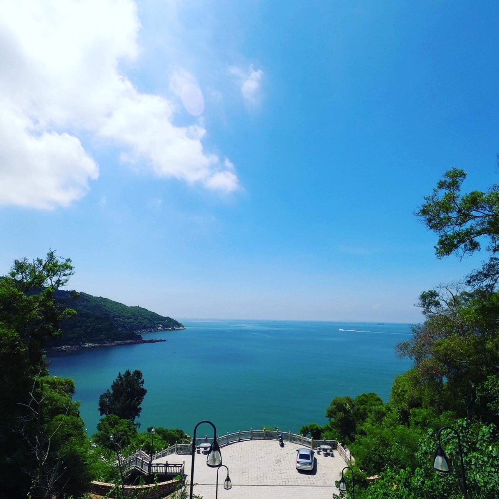</td>
	</tr>
	<tr>
		<td>舊時的戰備隧道, 戰爭結束後因為隧道長年低溫的環境, 馬祖人便利用其來存放高粱酒. 坑道內酒香四溢, 阿德才剛靠近坑道入口便受不了了XD 不過坑道後段為工作區, 遊客是禁止進入的. 因此坑道就短短百來尺而已.</td>
		<td colspan="2"><td>
	</tr>
	<tr>
		<td>北海坑道是南竿行的重點, 近年在觀光局的努力下開放了獨木舟, 搖櫓和夜間觀賞藍眼淚的活動. 獨木舟挺有趣的, 穿梭在北海坑道的鬼斧神工之下, 更令人敬佩當初開挖坑道的國軍. 原本對夜觀很期待, 只能說跟照片有差啦😅 我是要看藍眼淚, 不是閃光燈呀....</td>
		<td colspan="2">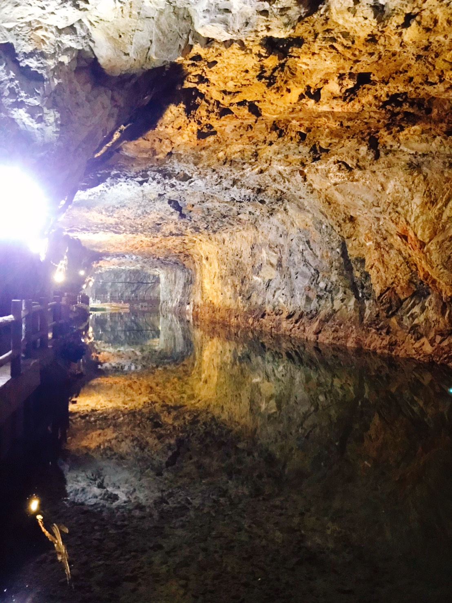</td>
	</tr>
	<tr>
		<td>運氣很好民宿旁邊就是津沙沙灘. 沙灘非常乾淨海水也很清澈. 傍晚的時光不知不覺就過了.</td>
		<td colspan="1">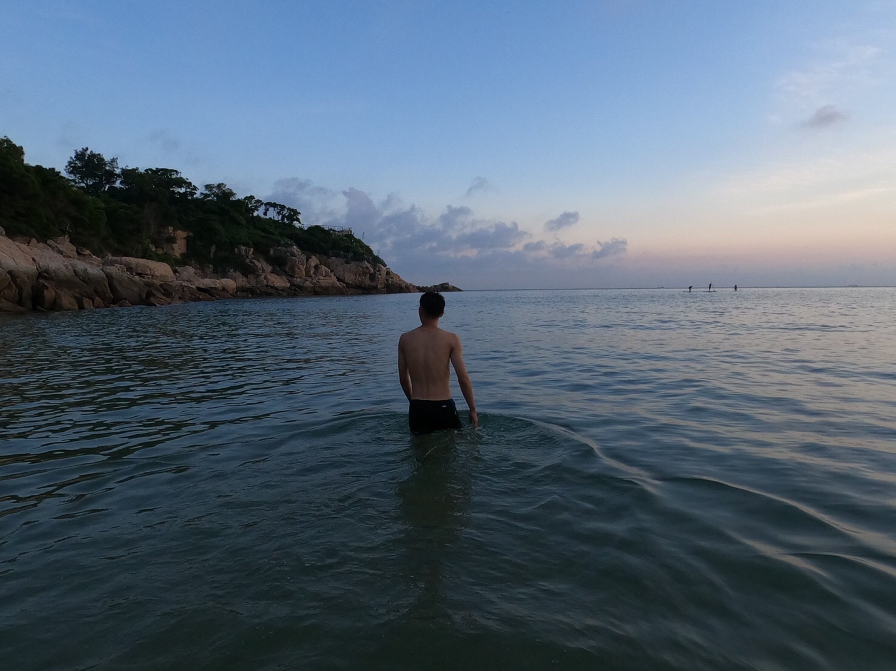</td>
		<td colspan="1"></td>
	</tr>
</table>

<h2 id="day2">Day2</h2>

在南竿的最後半天不是很順利. 
原本打算探訪獅子市場很有名的鼎邊糊, 還是因為疫情所以不開放內用. 
於是就在市場邊的早餐店隨便吃了點. 不是很令人滿意的早餐, 炸地瓜餃太甜, 繼光餅又是用炸的. 
去了大漢據點又因為據點內的電路異常不開放... 
最後只能回津沙沙灘又玩了一個早上的. 

下午就搭船前往北竿了, 民宿老闆很熱心的把我們送到登船處. 
路上還跟我們說了馬祖正確的打開方式, 說是最好還是住在南竿然後其他島嶼一日遊即可. 
礙於北竿民宿的訂金已付, 沒辦法還是只能前往北竿 
事實也如老闆所言...北竿, 真的是一個很適合一日遊的地方呢! 

| ℹ️ | 📷 |
| --- | --- |
|北竿的遊客較少, 步道上幾乎沒遇到遊客. 可以獨享整座螺蚌山. 當漲潮時海水會淹沒螺山與蚌山的連接處, 看起來就像兩座獨立的島嶼. 步道只有700公尺不過地形崎嶇, 走起來也是頗費力.|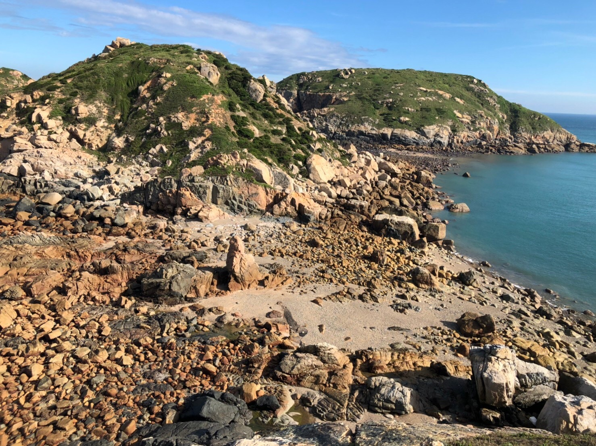|
|我們又挑戰了一次地瓜餃XD, 這次是在板里大宅旁,google評分頗佳的[小店面](https://www.facebook.com/banligoodchill/), 這個地瓜餃就做的很有水準了! 內部是堅果類. 吃起來不像在南竿吃到的那麼甜膩. 不過價格也是頗高, 小小一碗要價80元|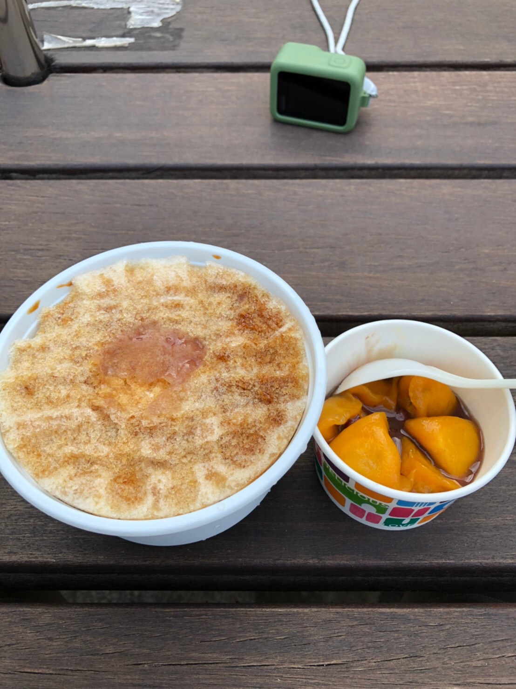|
|回民宿的路上太陽已經西沉了. 阿德隨手取景竟也如此意境. 北竿雖然人文開發的不多, 但是自然風景卻被更多保留了下來.|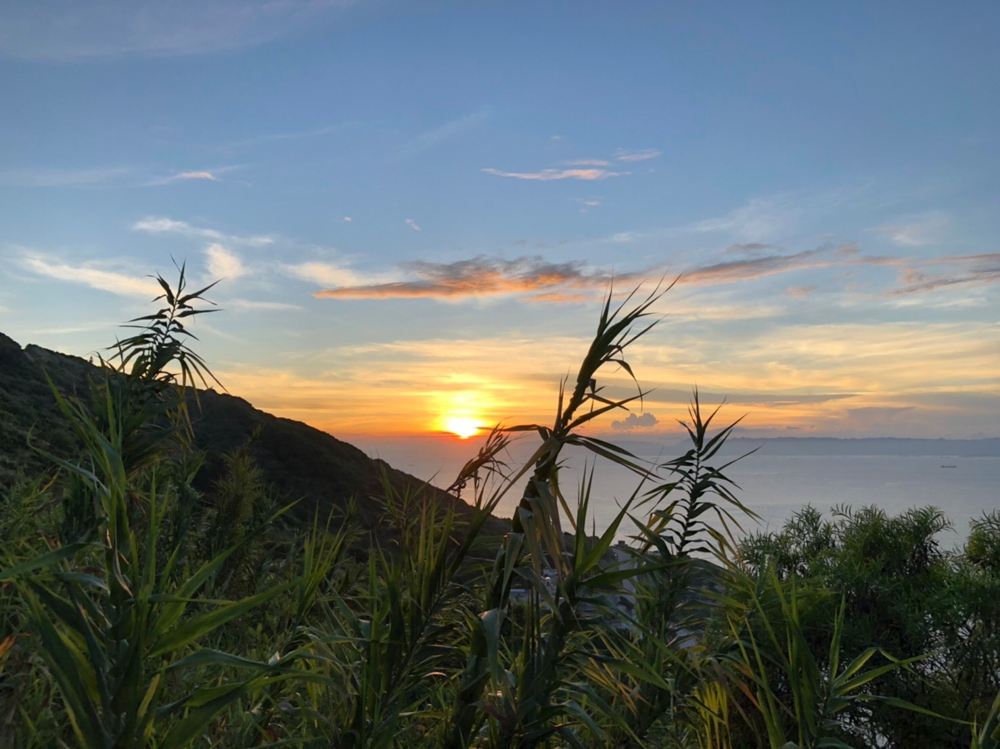|

北竿的地形更加崎嶇, 且因開發不深, 入夜時北竿幾乎沒有適合夜遊的地方. 
連續兩天精力的揮霍, 我跟阿德便決定拜訪好友推薦的麵店後就準備休息. 
原本並沒有抱著太大的期待, 中午吃了民宿老闆推薦的魚麵店, 感覺跟我們的口味不合. 
卻沒成想又一次被驚呆了:heart_eyes: 
嚐客 [Google Maps](https://www.google.com/maps?q=%E5%9A%90%E5%AE%A2+%E5%8C%97%E7%AB%BF&sxsrf=AOaemvILjLDyDklkFcaqE8kWP7SH4FVf5A:1630995861928&gs_lcp=Cgdnd3Mtd2l6EAM6CAgAELADEM0COgQIIxAnOgQIABBDOgUIABCABDoGCAAQChBDOgQIABAeOgIIJjoFCAAQzQI6BQghEKABSgQIQRgBUIMKWJ8bYLMcaANwAHgAgAFIiAGzBZIBAjEymAEAoAEByAEBwAEB&uact=5&um=1&ie=UTF-8&sa=X&ved=2ahUKEwiWxvCJnezyAhWRNaYKHbNqAQUQ_AUoAXoECAEQAw)/[Website](https://www.facebook.com/%E5%9A%90%E5%AE%A2-%E9%A6%AC%E7%A5%96%E5%9C%A8%E5%9C%B0%E7%BE%8E%E9%A3%9F-%E5%8C%97%E7%AB%BF7-11%E5%B0%8D%E9%9D%A2-928396107197656/)
| ℹ️ | 📷 |
| --- | --- |
|朋友大推的狗麵, 麵非常筋道且調味蠻符合台灣人的口味, 真的是吃了會停不下來的口味. 隔天離開北竿前我們又再吃了一次XD|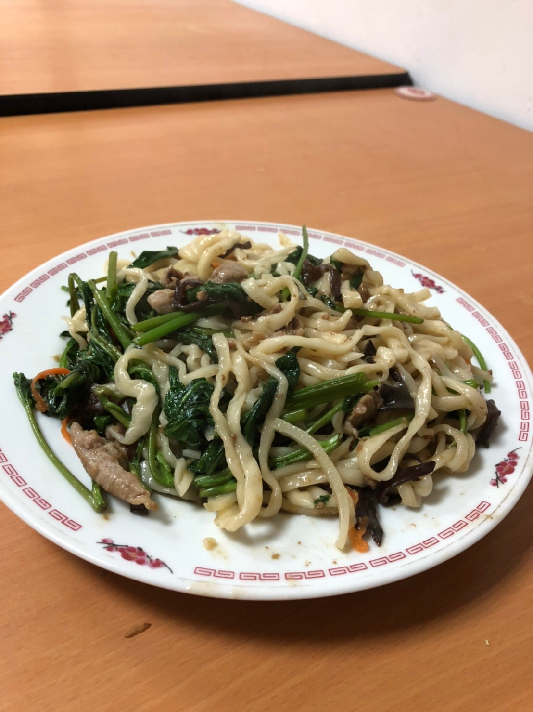|

## 結語
三天兩夜的馬祖行很快就過去了, 又回到了工作崗位上看著公司八點檔不斷上演. 
當初小小抱怨北竿有些無聊, 現在又懷念那時完全放空的精神狀態. 
在台灣的離島中, 馬祖算是觀光開發程度相對低的地方. 也因此在馬祖上能真正感受到脫離了都市. 
雖然很短暫(因為某個神奇的安排. 在下了回台灣的飛機後, 我們幾乎試跑百米的衝上了火車. 真的有瞬間被拉回都市的感覺:joy:). 
